# 사용자 화면  
  

## 메인화면
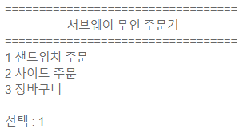  
   
 
 

## 메뉴 1 선택 시 화면  
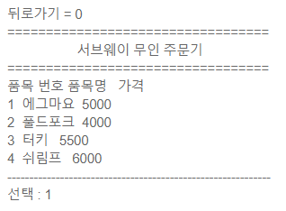  
* 샌드위치 전체 메뉴가 보여지고, 사용자는 한 메뉴를 선택할 수 있다.    
   
 

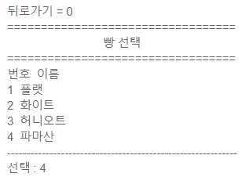  
* 샌드위치 메뉴를 선택하면 빵을 고르는 화면이 보여진다.   
   
 

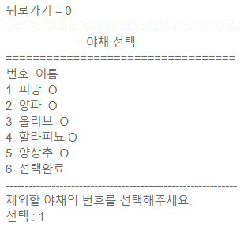  
* 빵을 고르면 제외할 야채를 선택할 수 있는 화면이 보여진다.   
* 초기 화면에는 'O' 표시를 통해 모든 야채가 샌드위치에 들어가는 것을 확인시켜준다.  
   
 

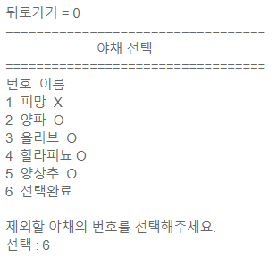  
* 사용자가 제외할 야채를 선택했다면, 다음 화면에서는 'X' 표시로 바뀌며 해당 야채가 들어가지 않는다는 것을 확인시켜준다.   
* 사용자가 마지막 숫자(6)을 입력하기 전까지 야채 선택과정을 반복한다.   
    
 

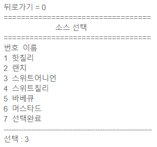  
* 야채 선택 완료 후 소스를 선택하는 화면을 보여준다.   
   
 

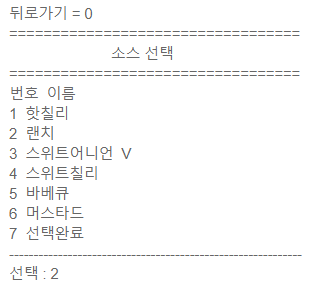   
* 선택된 소스 옆에 'V'표시를 해줌으로써 해당 소스가 선택되었음을 사용자에게 확인시켜준다.   
   
 

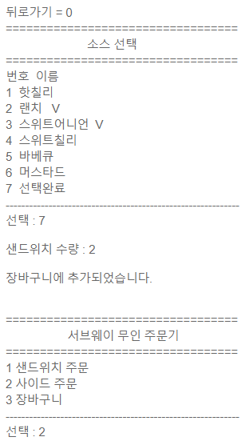  
* 사용자가 마지막 숫자(7)을 입력하기 전까지 소스를 선택하는 과정이 반복된다.  
* 마지막 숫자를 입력했을 시에는 현재까지의 선택사항이 적용된 샌드위치를 몇 개 주문할 것인지 입력하도록한다.  
* 수량 입력 후에는 "장바구니에 추가되었습니다"라는 메시지를 출력해주고, 메인 화면으로 돌아간다.   
* 사용자는 추가 주문을 하거나 장바구니에서 샌드위치의 선택사항을 확인할 수 있다.   
   
   
 

## 메뉴 2 선택 시 화면
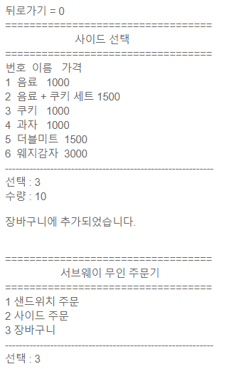  
* 사용자는 구매할 사이드 메뉴를 선택하고 수량을 입력하게 된다.   
* 수량 입력 후 "장바구니에 추가되었습니다"라는 메시지를 출력해주고, 메인 화면으로 돌아간다.  
   
   
 

## 메뉴 3 선택 시 화면
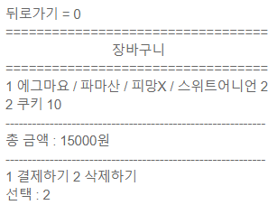  
* 여태까지 저장된 메뉴들을 보여준 후 결제와 삭제 중 선택하도록 한다.   
   
 

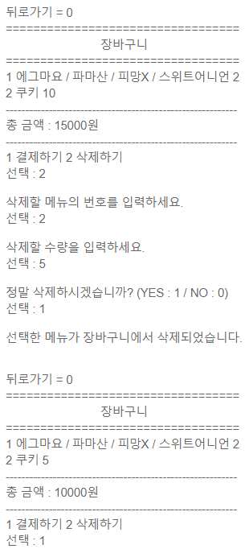  
* 사용자가 삭제를 선택했을 시에는 삭제할 메뉴 선택 > 수량을 입력하도록 한다.   
* "정말 삭제하시겠습니까?"라는 경고 메시지를 띄워 한번 더 확인하도록 한다. 
* 사용자가 1번을 선택했을 시에는 장바구니에서 해당 메뉴를 수량만큼 삭제한다.   
   
 

  
* 사용자가 결제를 선택했을 시에는 결제 방법을 선택하도록 한다. 
    - 포인트 적립을 사용하지 않을 경우에는 1번을 선택한다. 
    - 포인트 적립을 사용할 경우에는 2번을 선택한다. 
    - 적립된 포인트를 결제에 사용하고자 할 경우에는 3번을 선택한다.   

* 카드 결제를 할 때에는 카드 번호의 유효성 검사를 실시한다.   
    
 

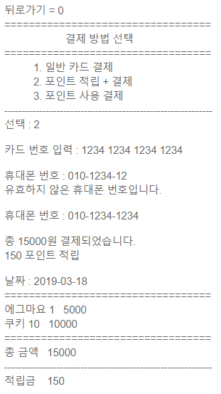   
* 사용자가 포인트 적립을 원하는 경우에는 핸드폰 번호를 입력받는다.   
* 기존 데이터에 해당 핸드폰이 존재하는 경우 기존 적립금에 추가 적립한다.
* 해당 핸드폰이 없는 경우 새롭게 저장하도록 한다.   
* 포인트는 총 결제금액의 10%로 한다. 
   
 

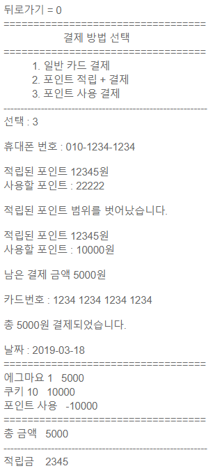  
* 포인트 사용 결제를 선택했을 경우에는 먼저 핸드폰 번호를 입력받는다.   
* 먼저 핸드폰 번호로 검색된 적립 포인트를 화면에 보여준다. 
* 사용자는 그 중 얼마를 사용할지 입력한다.   
* 총 결제 금액에서 사용할 포인트가 차감된 금액을 카드 결제 받는다.    
* 포인트를 사용한 결제에서는 포인트 적립이 이루어지지 않는다.   
 
 
 

# 관리자 화면  
 
 
## 메인화면
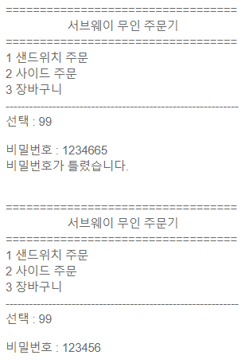    
* 메인 화면에 히든 메뉴 99를 등록해 놓는다.  
* 메뉴 선택에서 99를 입력하면 비밀번호를 입력받는 메시지가 출력된다.   
* 비밀번호를 맞게 입력하면 관리자 메인화면으로 들어갈 수 있다.   
   
   
 

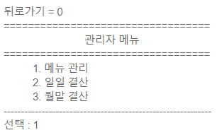    
* 관리자 메뉴에는 메뉴관리 / 일일 결산 / 월말 결산이 있다.   
   
 

## 메뉴 1 선택 시 화면
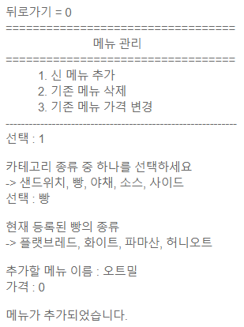   
* 메뉴 1의 서브 메뉴에는 신메뉴 추가 / 기존 메뉴 삭제 / 기존 메뉴 가격변경이 있다.   
* 서브 메뉴 1을 선택했을 때에는 신메뉴를 추가할 수 있는 카테고리를 먼저 보여주고, 선택하도록 한다.   
* 카테고리가 선택되면 해당 카테고리가 가지고 있는 자료들을 보여준다. 
* 관리자는 추가할 메뉴의 이름과 가격을 입력하게 된다.   
   
 

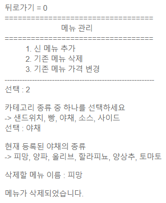    
* 서브 메뉴 2를 선택했을 때에도 카테고리와 카테고리가 가진 자료들을 보여준다.   
   
 

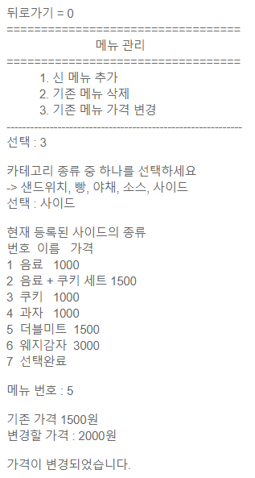    
* 서브 메뉴 3을 선택했을 때에도 카테고리와 카테고리가 가진 자료들을 보여준다.  
* 가격을 변동할 메뉴가 선택되면 기존 가격을 보여주고, 변경 가격을 입력받는다.   
   
 

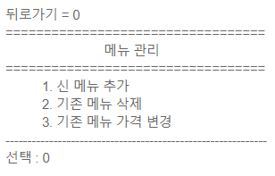  
* 0을 입력하면 이전화면(관리자 메인화면)으로 돌아갈 수 있다.   
   
 

## 메뉴 2 선택 시 화면
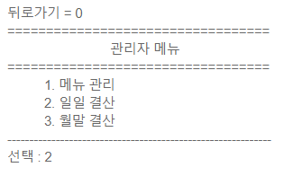    
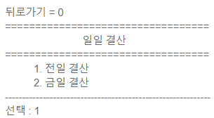    
* 일일 결산 메뉴에서는 전일과 금일의 결산을 확인할 수 있다.   
   
 

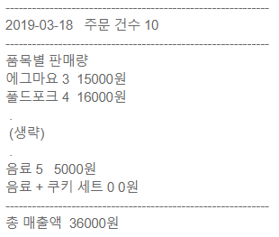    
* 결산 내역에는 날짜, 주문건수, 품목별 판매량, 총 매출액이 출력된다.   
   
 

## 메뉴 3 선택 시 화면
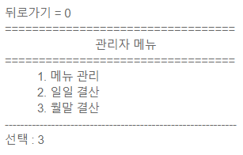   
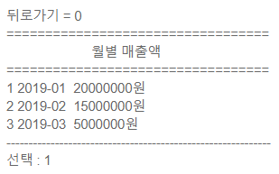   
* 월말 결산 선택 시 이번 년도 모든 월의 총매출액을 확인할 수 있다.   
   
  

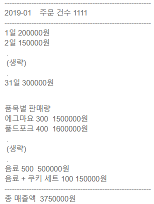  
* 관리자가 번호를 입력해 특정 월을 선택하면 그 달 모든 일자의 매출액과 품목별 판매량을 보여준다.     
   
    

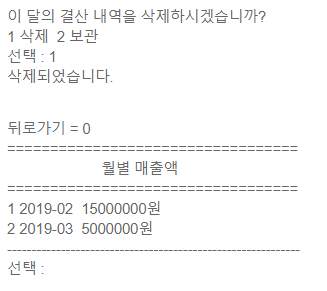  
* 관리자가 결산내역을 삭제하고자 하는 경우에 특정월의 결산 내역을 삭제할 수 있다.   