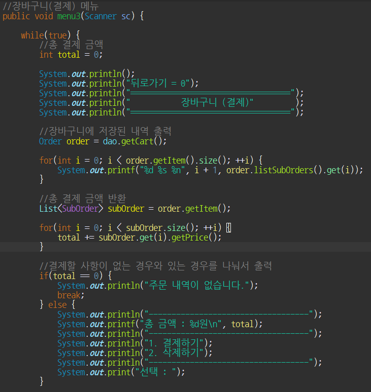

# 샌드위치 무인 주문기 프로그램
### 개요
본 프로그램은 Subway를 기반으로 한 무인 주문 시스템으로, 매장을 찾은 고객은 빵부터 소스까지 자신의 취향에 맞춰 주문할 수 있으며 관리자는 메뉴 관리는 물론, 일일 결산과 월말 결산을 할 수 있다.  

   
본 코드 리뷰에서는 장바구니 내역 확인 및 결제 액션을 다루었다.  
     
 

### 사용된 주요 기술 목록
* 주요기술  
Java SE, OOP, Collection, Generic
* 개발환경  
Eclipse  
   
   

### 장바구니 (결제) 액션 플로우 

   
   

### 메소드 설명
* public void menu3(Scanner sc) { }  
 장바구니에 저장된 내역을 출력하는 메소드  
사용자의 입력을 받아 pay1 / pay2 / pay3 또는 deleteOrder로 넘어간다.
* private void pay3(Scanner sc, int total) { }  
    일반 카드 결제 메소드
* private void pay3(Scanner sc, int total) { }  
    포인트 적립 결제 메소드
* private void pay3(Scanner sc, int total) { }  
    포인트 사용 결제 메소드 
* private void bill(int point, int total, int usePoint) { }  
    영수증 발급 메소드
* private void deleteOrder(Scanner sc, Order order, List<SubOrder> subOrder)  
    장바구니 내역 삭제 메소드 

   
   

### 결과화면
  
  

   
   

### 주요 코드 분석

